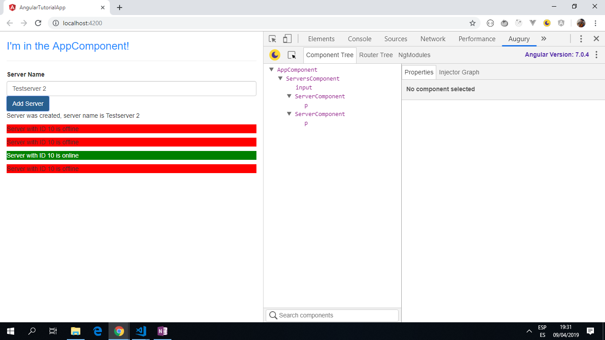

# :zap: Angular Tutorial App

* A simple Angular app to display a list of servers and indicate whether the server is on or offline.
* Server names can be added to the list.
* **Note:** to open web links in a new window use: _ctrl+click on link_


## :page_facing_up: Table of contents

* [:zap: Angular Tutorial App](#zap-angular-tutorial-app)
  * [:page_facing_up: Table of contents](#page_facing_up-table-of-contents)
  * [:books: General info](#books-general-info)
  * [:camera: Screenshots](#camera-screenshots)
  * [:signal_strength: Technologies](#signal_strength-technologies)
  * [:floppy_disk: Setup](#floppy_disk-setup)
  * [:computer: Code Examples](#computer-code-examples)
  * [:cool: Features](#cool-features)
  * [:clipboard: Status & To-Do List](#clipboard-status--to-do-list)
  * [:clap: Inspiration](#clap-inspiration)
  * [:envelope: Contact](#envelope-contact)

## :books: General info

* This course project is to help learn about basic Angular concepts, including using components, data & property binding, the formsmodule etc.

## :camera: Screenshots

.

## :signal_strength: Technologies

* [Angular v12](https://angular.io/)
* [RxJS Library v6](https://angular.io/guide/rx-library) used to handle datastreams and propagation of change using observables.
* [Angular Augury Chrome Extension](https://chrome.google.com/webstore/detail/augury/elgalmkoelokbchhkhacckoklkejnhcd) v1.23.0 used for debugging.

## :floppy_disk: Setup

* Install dependencies by running `npm i`
* Run `ng serve` for a dev server. Navigate to `http://localhost:4200/`. The app will automatically reload if you change any of the source files
* Run `ng build` to build the project. The build artifacts will be stored in the `dist/` directory. Use the `--prod` flag for a production build

## :computer: Code Examples

* _server component with functions used to generate html template data._

```typescript
import { Component } from '@angular/core';

@Component({
  selector: 'app-server',
  templateUrl: './server.component.html',
  styles: [`
    .online {
      color: white;
    }
  `]
})
export class ServerComponent {
  serverId = 10;
  serverStatus = 'offline';

  // use a random number generator function to get a random status of on or offline
  constructor() {
  this.serverStatus = Math.random() > 0.5 ? 'online' : 'offline';
  }

  // function to return the random server status
  getServerStatus() {
    return this.serverStatus;
  }

  // function to show online status with a green background and offline with red.
  getColor() {
    return this.serverStatus === 'online' ? 'green' : 'red';
  }
}

```

## :cool: Features

* Server names can be added via a form-control input field.
* The background color of each server in the list changes depending on the online status of the server.
* Updated to latest Angular v11 with dependencies updated & 0 vulnerabilities.

## :clipboard: Status & To-Do List

* Status: Working. Updated may 2021
* To-Do: Nothing

## :clap: Inspiration

* All code is from [Maximilian Schwarzmüller's Angular course](https://www.udemy.com/the-complete-guide-to-angular-2/learn/v4/overview) - now 2020 edition

## :file_folder: License

* This project is licensed under the terms of the MIT license.

## :envelope: Contact

* Repo created by [ABateman](https://github.com/AndrewJBateman), email: gomezbateman@yahoo.com
